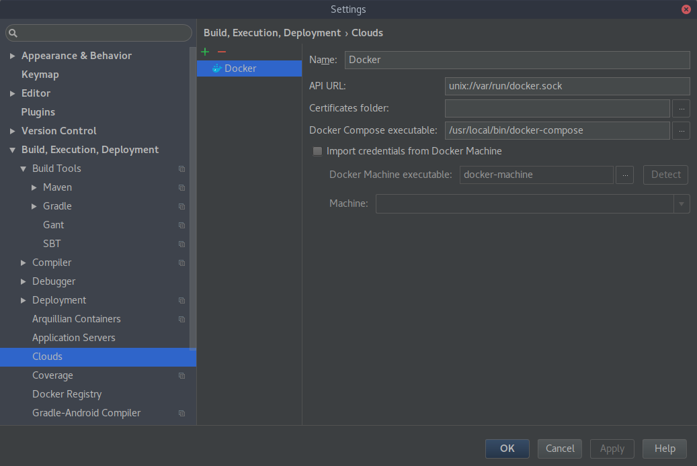

# Installer Docker

- Vérifier que la version de son kernel linux est supérieur à la 3.10 avec la commande `uname -r`
- Dans tous les cas, il est recommandé d'utiliser la version la plus récente du kernel linux
- Lancer le script `install_docker.sh`
- Le script prend en charge le proxy de l'EISTI avec un petit menu
- Les scripts permettant de travailler ou non avec le proxy se situe dans le dossier `proxy` (`unset_proxy.sh` et `set_proxy.sh`)
- Redémarrer son ordinateur une fois Docker installé
- Pour vérifier que Docker et Docker-compose sont bien installé : `docker version` et `docker-compose version`

# Les bons réflexes avec Docker

- Pour lister toutes ses images : `docker images --all`
- Pour lister tout ses containers : `docker ps --all`
- Pour supprimer une images : `docker rmi IMAGE_ID`
- Pour supprimer un container : `docker rm CONTAINER_ID`
- Pensez donc à vérifier régulierement que vous n'avez pas une tonne d'images ou de containers innutiles sur votre machine
- Pour éviter qu'un container soit conservé aprés son execution, on utilise : `docker run --rm IMAGE_ID`
- Sinon vous pouvez réutiliser les containers qui sont fini en les relancant avec `docker start CONTAINER_ID`

# Configurer InteliJ IDEA pour Docker

- Installer le plugin Docker pour InteliJ IDEA dans **File | Settings... | Plugins | Browse repositories...**, taper _docker_ puis cliquer sur **Install**
- Appliquer et redémarrer l'IDE
- Aller ensuite dans **File | Settings... | Build, Execution, Deployment | Clouds**, et créer une configuration **Docker** avec le petit plus vert
- La configuration doit être la suivante (Bien avoir `docker-compose` comme executable) : 
- Aller dans **Run | Edit configurations...**, et créer une configuration de **Docker Deployment** avec le petit plus vert
- La configuration doit être la suivante (Bien séléctionner le ficher `docker-compose.yml`) : 
